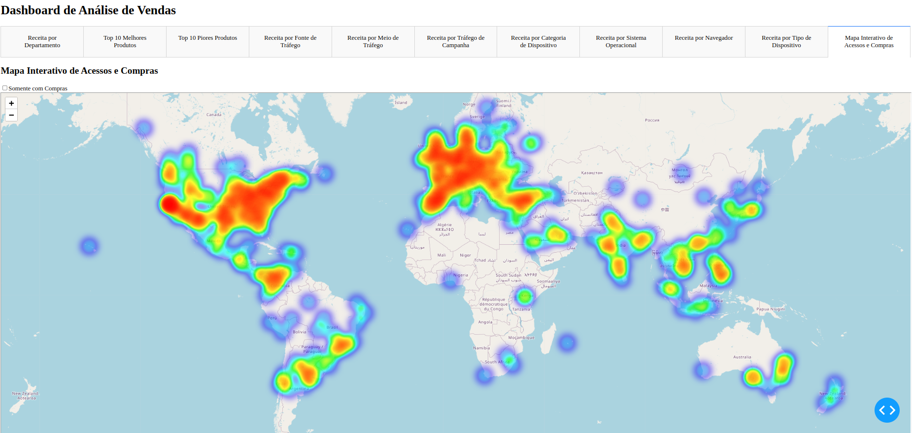

# README - Dashboard de Análise de Vendas do E-commerce

## Introdução

Este projeto apresenta a solução para a Questão 1 do case técnico - Data Scientist para a Etus Media. As respostas e resultados podem ser visualizados através de um dashboard interativo para análise de vendas do site e-commerce disponibilizado na base pública do Google BigQuery.

As decisões de projeto foram cuidadosamente pensadas para garantir segurança, eficiência e facilidade de uso, proporcionando insights valiosos para as áreas de marketing e vendas.

## Como Executar o Projeto

Versão do Python utilizada: Python 3.10.8
Versão do Pip utilizada: pip pip 22.3.1

1. **Instalar Dependências**:
   ```bash
   pip install -r requirements.txt
   
   ```
2. **Executar o notebook**:
   Acesse o notebook `ETUS_media_questao1.ipynb` e siga o fluxo das células para executar o projeto e entender as análises realizadas.

## Decisões de Projeto

### Autenticação e Acesso aos Dados

Para acessar os dados do Google BigQuery, optei por instalar o `gcloud CLI` na minha máquina e realizar a autenticação através dele. Esta decisão foi motivada pelos seguintes fatores:

1. **Segurança**: A autenticação via `gcloud CLI` é mais segura, garantindo a proteção dos dados.
2. **Familiaridade**: Tenho mais familiaridade com ferramentas de linha de comando, o que facilita o processo de autenticação e gerenciamento dos dados.

### Manipulação dos Dados

Para acessar e manipular os dados do BigQuery, utilizei queries SQL simples. Essa escolha se baseou em minha expertise prévia com SQL, que é uma linguagem poderosa e fácil de usar para manipulação de dados. Para obter os dados de forma pandas-like e manipulável, optei pela biblioteca `pandas_gbq`, que permite a execução de queries SQL diretamente no BigQuery e a obtenção dos resultados em um dataframe pandas. Esta abordagem é recomendada pelo próprio pandas, uma vez que a função original de conexão com o BigQuery será descontinuada.

### Análises de Dados

As análises focaram em métricas essenciais para o desempenho do e-commerce, especificamente a receita das transações. As principais análises realizadas foram:

1. **Receita por Área da Loja (Categoria)**: Gráfico mostrando a receita total por categoria de produto.
2. **Top 10 Produtos por Receita**: Gráfico destacando os produtos com maior receita.
3. **Distribuição das Receitas dos Produtos**: Gráfico de distribuição das receitas, com análise estatística para verificar normalidade e variações significativas.

### Ferramentas específicas Utilizadas

1. **Plotly**: Utilizado para a criação de gráficos interativos e de fácil manipulação. A escolha dessa biblioteca se deu pela sua facilidade de uso e a capacidade de criar visualizações atraentes e dinâmicas.
2. **Folium e Geopy**: Utilizadas para a criação de um mapa-mundi interativo, mostrando a distribuição geográfica dos clientes do e-commerce.

### Dashboard Interativo

A apresentação dos dados foi realizada através de um dashboard interativo, criado com a biblioteca `Dash` do Plotly. Esta abordagem permite a visualização dos dados de forma dinâmica e atraente, facilitando a exploração dos dados por usuários que não possuem conhecimento técnico em análise de dados. O dashboard inclui múltiplas abas com gráficos interativos e um mapa, proporcionando uma 
experiência completa e intuitiva para o usuário final. Abaixo está um exemplo de como o dashboard se parece:


#### Mapa Interativo:



## Conclusões das Análises

Para as análises estatísticas da receita dos produtos, optei por utilizar os métodos estatísticos ANOVA e Shapiro-Wilk. O teste ANOVA foi utilizado para verificar se há diferenças significativas entre as receitas das diferentes áreas da loja, enquanto o teste Shapiro-Wilk foi utilizado para verificar a normalidade da distribuição das receitas dos produtos. Os resultados desses testes são apresentados a seguir:


1. **Receita por Área da Loja**: Identificamos as categorias de produtos com maior receita, permitindo focar em áreas mais lucrativas.
2. **Top 10 Produtos**: Destacamos os produtos com maior destaque em receita, essenciais para decisões de estoque e marketing.
3. **Distribuição das Receitas**: A análise estatística revelou insights sobre a normalidade e variações significativas nas receitas dos produtos.
4. **Distribuição Geográfica**: O mapa interativo permite identificar regiões com maior densidade de clientes, facilitando o direcionamento de campanhas de marketing e expansão de mercado.


